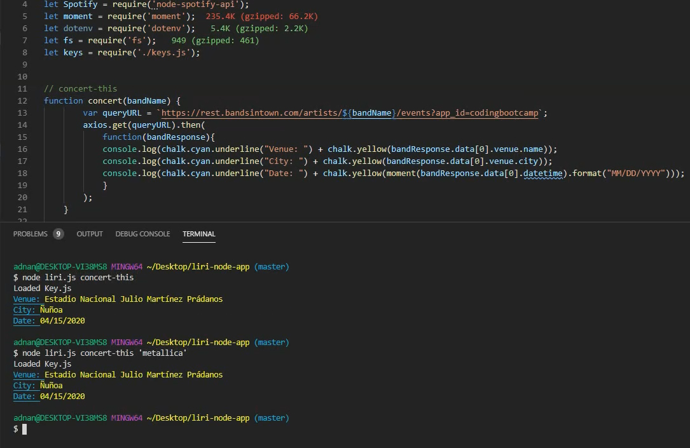
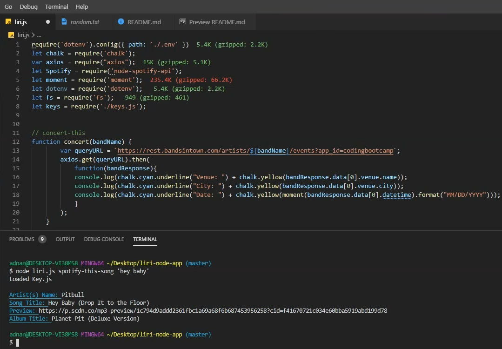

<h1> LIRI Bot </h1>
<h2>UCB-2019 Class Assignment</h2>

    In this assignment, we'll make LIRI. LIRI is like iPhone's SIRI. However, while SIRI is a Speech Interpretation and Recognition Interface, LIRI is a Language Interpretation and Recognition Interface. LIRI will be a command line node app that takes in parameters and gives you back data.

<h3>Liri Commands:</h3>
    <code>1. concert-this</code> 
    <code>2. spotify-this-song</code> OR  
    <code>spotify-this-song songName</code> 
    <code>3. movie-this</code> OR  
    <code>movie-this movieName</code> 
    <code>4. do-what-it-says</code>

<h3>Technologies used</h3>
<ul>
    <li>Dotenv</li>
    <li>fs</li>
    <li>moment</li>
    <li>axios</li>
    <li>chalk</li>
    <li>spotify</li>
</ul>

<h3>Installation guide</h3>

<ol>
    <li>run <code>npm install</code></li>
    <li>provide your own spotify id & secrete and in the dotenv file</li>
    <li>provide you own OMDB api key</li>
</ol>

<h2>Require & Local Linked files</h2>
LIRI required installation of several npm packages and links to local files. 

<code>
require("dotenv").config();  
var fs = require("fs");  
var moment = require("moment"); 
var axios = require("axios"); 
var Spotify = require("node-spotify-api"); 
var spotifyKeyInfo = require("./keys.js"); 
var chalk = require("chalk");</h2>
</code>

<h2>&nbsp;&nbsp;&nbsp;&nbsp; &nbsp;<a href="https://drive.google.com/file/d/1pH_UW2Q5wHKsA0pCWo0RtfhsrOzgLUaG/view?usp=sharing"><u>Click here to see Video walk-through</u></a></h2>

<h2>Below are Demo Images</h2>

<h3>concert-this</h3>

  
<h3>concert-this bandName</h3>

  
<h3>spotify-this-song</h3>

  
<h3>spotify-this-song songName</h3>

  
<h3>movie-this</h3>

  
<h3>movie-this movieName</h3>

  
<h3>do-what-it-says</h3>
