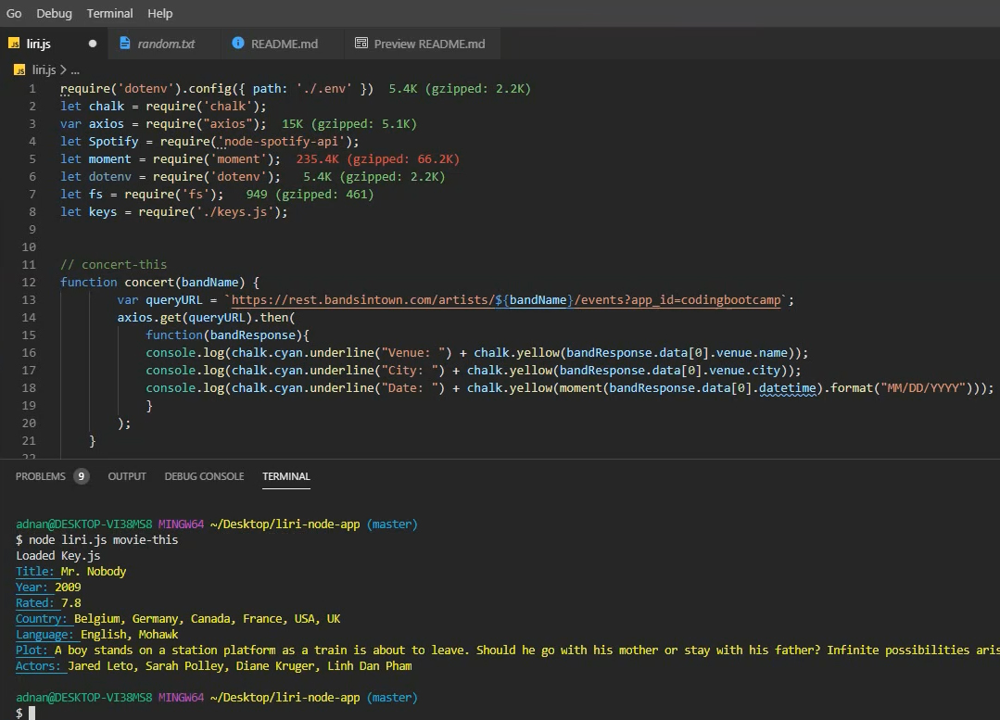
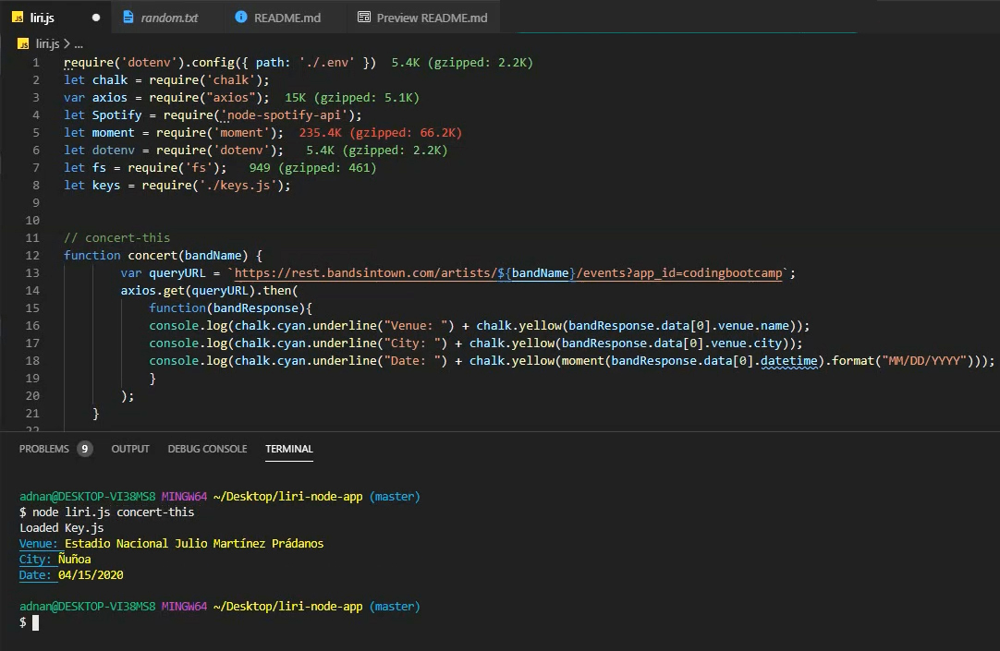

<h1> LIRI Bot </h1>
<h2>UCB-2019 Class Assignment</h2>

    In this assignment, we'll make LIRI. LIRI is like iPhone's SIRI. However, while SIRI is a Speech Interpretation and Recognition Interface, LIRI is a Language Interpretation and Recognition Interface. LIRI will be a command line node app that takes in parameters and gives you back data.

<h3>Liri Commands:</h3>
    <code>1. concert-this</code> 
    <code>2. spotify-this-song</code> OR  
    <code>spotify-this-song songName</code> 
    <code>3. movie-this</code> OR  
    <code>movie-this movieName</code> 
    <code>4. do-what-it-says</code>

<h3>Technologies used</h3>
<ul>
    <li>Dotenv</li>
    <li>fs</li>
    <li>moment</li>
    <li>axios</li>
    <li>chalk</li>
    <li>spotify</li>
</ul>

<h3>Installation guide</h3>

<ol>
    <li>run <code>npm install</code></li>
    <li>provide your own spotify id & secrete and in the dotenv file</li>
    <li>provide you own OMDB api key</li>
</ol>

<h2 style='text-align:center'>Visual walk-through</h2>

<code>node liri.js movie-this</code>

<code>node liri.js movie-this 'fight club</code>

<code>node liri.js concert-this</code>

<code>node liri.js concert-this</code>

